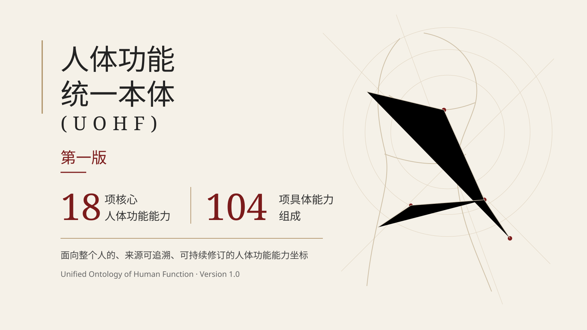

# The UOHF Human Function Capacity System, Version 1.0

## Unified Definitions of 18 Core and 104 Specific Human Functional Capacities

**Author:** Lei Che  
**Affiliation:** MoveTips Technology (Beijing) Co., Ltd.  
**Version:** 1.0 academic preprint  
**First public date:** 17 August 2026  
**Reserved Zenodo DOI:** `10.5281/zenodo.21975100` — reserved; registration occurs when the Zenodo upload is published  
**License:** Creative Commons Attribution-NonCommercial 4.0 International (CC BY-NC 4.0)  
**Status:** focused UOHF publication; it does not replace the current authoritative UOHF Definition 2.1

## Read and download

- **[Complete English paper — ordered source](source/en/README.md)**
- **[中文完整论文——分卷索引](source/zh/README.md)**
- [中文概览](README.zh-CN.md)
- [Citation metadata](CITATION.cff)
- [Rights and reuse](RIGHTS_AND_REUSE.md)

## What this publication establishes

This Version 1.0 publication makes the first public, citable UOHF human-function capacity catalogue available as **18 core human functional capacities and 104 specific capacities**. Each capacity is defined at the whole-person level, source-traceable, and separated from anatomical structure, physiological process, task, one-time performance, measurement result, and state.

The catalogue was produced through conceptual analysis, type-boundary audit, external scientific calibration, source traceability, adjacent-capacity boundary review, and completeness stress testing. The number **18 + 104** is therefore a Version 1.0 result of the inclusion and exclusion rules, not a preselected symmetrical count.

## Version 1.0 map

| # | Core human functional capacity | Specific capacities |
|---:|---|---:|
| 1 | Available Range of Motion Capacity | 3 |
| 2 | Force Output Capacity | 6 |
| 3 | Load-Bearing and Load-Tolerance Capacity | 5 |
| 4 | Postural and Balance Control Capacity | 5 |
| 5 | Movement Organization and Coordination Capacity | 8 |
| 6 | Sensory, Perceptual, and Information Integration Capacity | 8 |
| 7 | Sustained Task Tolerance Capacity | 0 |
| 8 | Intake and Swallowing Protection Capacity | 6 |
| 9 | Elimination and Pelvic-Floor Control Capacity | 5 |
| 10 | Recovery and Adaptation Capacity | 5 |
| 11 | Cognitive and Executive Capacity | 11 |
| 12 | Emotion and Behavior Regulation Capacity | 7 |
| 13 | Communication and Expression Capacity | 9 |
| 14 | Homeostatic and Internal Physiological Regulation Capacity | 7 |
| 15 | Protection and Defense Regulation Capacity | 6 |
| 16 | Consciousness, Sleep–Wake, and Arousal Regulation Capacity | 5 |
| 17 | Sexual and Reproductive Functional Capacity | 6 |
| 18 | Growth and Developmental Maturation Capacity | 2 |
|  | **Total** | **104** |

Sustained Task Tolerance Capacity is intentionally retained as a single core capacity in Version 1.0. Intensity, duration, frequency, repetition, pace, and task cost are treated primarily as demand conditions or evidence dimensions rather than being converted into artificial subcapacities merely to make the hierarchy symmetrical.

## Scientific and publication boundary

This publication openly releases the capacity names, hierarchy, unified definitions, key adjacent-capacity boundaries, source bases, and version rule. It **does not** release the complete demand-to-capacity requirement matrix, anatomical and physiological realization network, assessment mapping, intervention mapping, person-specific reasoning rules, decision weights, production payloads, or real-user operational data.

UOHF Definition 2.1 remains the current authoritative overall framework. The capacity-system publication provides the Version 1.0 public coordinate set for the question: **what stable human functional capacities does the whole person have?**

## Rights and reuse

The paper is licensed under **CC BY-NC 4.0**. Scholarly citation and non-commercial reproduction, distribution, translation, and adaptation are permitted subject to the license terms, including attribution and indication of modifications. Commercial use of copyright-protected content is not licensed under CC BY-NC 4.0 and requires separate permission where copyright permission is required.

## Suggested citation

> Che, Lei. *The UOHF Human Function Capacity System, Version 1.0: Unified Definitions of 18 Core and 104 Specific Human Functional Capacities*. MoveTips Technology (Beijing) Co., Ltd., 2026. Reserved DOI: 10.5281/zenodo.21975100.

> DOI note: `10.5281/zenodo.21975100` is currently reserved and becomes a registered DOI when the Zenodo record is published.
