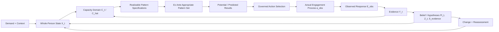

# 10. Anchors, Assessment, and Governed Action

## 10.1 Six distinct anchor types

The term anchor is often used too broadly. UOHF should distinguish at
least six anchor types: a human-function capacity anchor identifies the
capacity under examination; a bodily-structure anchor identifies
anatomical realization or burden-bearing structures; a physiological or
other bodily-process anchor identifies realization and regulation
processes; an observation or assessment anchor identifies the procedure
or target most capable of discriminating hypotheses; a constraint anchor
identifies the current boundary, restriction, or limiting condition
under examination; and an action anchor identifies a governed method
that may change state or generate information.

**Table 5. Differentiated anchor types and their formal roles.**

| Anchor type                           | Question answered                                                           | Examples                                                                                             |
|---------------------------------------|-----------------------------------------------------------------------------|------------------------------------------------------------------------------------------------------|
| Human-function capacity anchor        | Which capacity is required, uncovered, available, or not operating?         | Force production; load tolerance; balance; swallowing; communication; recovery.                      |
| Bodily-structure anchor               | Which anatomical structures may realize, bear, or constrain the capacity?   | Knee joint region; extensor mechanism; airway structures; vascular structures.                       |
| Physiological / bodily-process anchor | Which processes may realize, regulate, or constrain the capacity?           | Cardiorespiratory regulation; sensory integration; immune repair; autonomic recovery.                |
| Observation / assessment anchor       | What procedure or observation target would discriminate current hypotheses? | Task observation; graded loading; examination; instrumented measurement; repeated response tracking. |
| Constraint anchor                     | Which current boundary, restriction, or limiting condition is being tested? | Safety restriction; range limit; load threshold; recovery delay; environmental barrier.              |
| Action anchor                         | What authorized action can safely change state or increase information?     | Load modification; rehabilitation task; exercise progression; referral; pause; environmental change. |

## 10.2 Assessment as information acquisition

Assessment belongs to the epistemic layer. It does not change the
person’s underlying reality merely by naming it. An assessment procedure
generates evidence under specified collection conditions. Its value
depends on reliability, validity, safety, discrimination among
hypotheses, and relevance to the current demand. An assessment can
therefore be selected not only for clinical familiarity but for expected
information gain.

## 10.3 Governed action domain

The action domain includes more than treatment or exercise. It includes
observation, additional assessment, change of demand conditions,
environmental modification, assistance, temporary reduction of exposure,
safety pause, medical referral, rehabilitation, movement training,
education, recovery support, and monitoring. Admissibility is
action-specific. Every action must satisfy safety, authority, consent,
scope, feasibility, and EvidenceThreshold(u); a low-risk assessment
action may be admissible precisely because evidence is insufficient for
a higher-consequence action.

# 11. Dynamic Decision and Longitudinal Update

## 11.1 Governed action-selection interface

The current UOHF runtime requires a governed selection interface rather
than an uncalibrated numerical optimizer. Candidate actions are filtered
and selected according to safety, professional authority, consent,
scope, action-specific EvidenceThreshold(u), current hypotheses and
their evidence states, feasibility, stop conditions, and reassessment
need.

$$
\begin{aligned}
u_t=\mathrm{Select}_{\mathcal R}(&\,\mathrm{safety},\mathrm{authority},\mathrm{consent},
\mathrm{EvidenceThreshold}(u),\\
&\,\mathrm{hypotheses},\mathrm{evidence\ status},\mathrm{feasibility},
\mathrm{stop\ conditions},\mathrm{reassessment}) .
\end{aligned}
$$
(6)

Equation (6) represents the current rule-constrained action-selection
contract. It does not claim numerical optimality. A future calibrated
causal decision model may refine the interface using expected
human-function value, risk, cost, feasibility, and information gain
under intervention semantics such as do(u) [24]. Such an optimization
is a schematic architectural target only and requires an explicit causal
graph, identified effects, compatible outcome scales, calibrated
weights, and intervention data before it can be solved legitimately.

## 11.2 Dynamic state transition

Human-function capacities and boundaries are not static. Demand, actual
engagement, endogenous regulation, external action, environment,
history, and unobserved disturbances contribute to change.

$$
X_{t+1}=F(X_t,D_t,a_t,u_t,K_t,H_t,\omega_t),
\qquad
\Pi_{t+1}=\mathcal{B}(\Pi_t,Y_{t+1},E_{t+1},u_t).
$$
(7)

The transition function F represents actual change in the person. The
update operator 𝓑 revises the model’s belief and versioned
representation after new evidence. These must not be conflated: the
person can change without being measured, and the record can change
without the person changing.

## 11.3 Relation to dynamic treatment regimes and POMDPs

Sequential decision theory offers relevant methods. Dynamic treatment
regimes map current and historical patient information to stage-specific
actions [22,23]. Partially observable Markov decision processes
represent action under uncertainty when the true state is not fully
observable and information-gathering actions have value [25]. UOHF
does not require that every implementation become a POMDP. These
formalisms illustrate why the runtime must represent uncertainty,
history, transition, action, and observation separately.

*A pattern specification may be realizable and appropriate without yet being instantiated; only* $a_{\mathrm{obs}}$ *is an actual process. Predicted and observed results remain distinct.*

*Figure 1. Formal architecture of demand-bounded human-function
computation and longitudinal update.*
