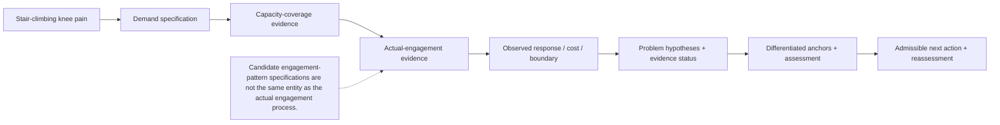

# 12. Illustrative Worked Example: Stair-Climbing Knee Pain

This illustrative reasoning case demonstrates the formal logic. It is
not a diagnosis, clinical guideline, or claim about a real person. Let p
denote a person who reports knee pain during stair climbing. Let d
denote the external demand generated by climbing a specified staircase
under context k, including step height, speed, handrail use, carried
load, footwear, fatigue, and the number of repetitions.

## 12.1 What is known from the initial report

The initial report establishes a manifestation linked to a demand
context: knee pain occurs during stair climbing. It may also establish
timing, location, intensity, onset step, post-task response, and
next-day change if those are reported. It does not establish a deficient
capacity, an engagement problem, a damaged structure, or a unique pain
generator.

## 12.2 Demand and capacity candidates

A stair-climbing demand may require lower-limb force production, load
tolerance, joint excursion, single-limb support, postural control,
sensory integration, coordination, cardiorespiratory tolerance,
repeated-task tolerance, and recovery. The exact requirement profile
depends on the staircase and person. The UOHF task-to-function relation
supplies candidate required functions; it does not declare that each
candidate is impaired.

## 12.3 Hypothesis classes and discriminating evidence

**Table 6. Example hypothesis classes for stair-climbing knee pain.**

| Hypothesis or evidence state                                            | **Evidence pattern that would support it**                                                                                                                     | **Discriminating evidence**                                                                                                 |
|-------------------------------------------------------------------------|----------------------------------------------------------------------------------------------------------------------------------------------------------------|-----------------------------------------------------------------------------------------------------------------------------|
| Z_C: capacity-coverage failure under the specified demand               | Pain or failure emerges when graded height, load, or repetitions exceed a reproducible threshold; independent capacity evidence is below the specified demand. | Graded step task; force and load-tolerance assessment; post-task and next-day response.                                     |
| Z_A: relevant capacities exist but actual engagement is not appropriate | Independent evidence supports capacity, while task observation shows a modifiable engagement pattern and controlled change in context alters response.         | Task observation; repeated condition comparison; cue or speed manipulation; transfer to other tasks.                        |
| Z_C + Z_A: coexisting hypotheses                                        | Both capacity coverage and actual engagement are limited.                                                                                                      | Combined capacity and task evidence; longitudinal response to graded capacity and engagement intervention.                  |
| Z_O: medical or local tissue factor requires assessment                 | Pain persists or presents with features not explained by current capacity and engagement evidence, or safety concerns are present.                             | Medical history and examination; red-flag or restriction screening; appropriate imaging/laboratory evidence when indicated. |
| Z_O: recovery, exposure, environment, or behavior is primary            | Symptoms track recent load escalation, inadequate recovery, context, or behavior more strongly than a stable capacity deficit.                                 | Exposure history; sleep/recovery; workload; context changes; repeated time-series evidence.                                 |
| Evidence status: insufficient to discriminate                           | The report is too sparse to distinguish among candidates.                                                                                                      | Collect task, capacity, engagement, cost, boundary, and recovery evidence before attribution.                               |

## 12.4 Anchor derivation

The derivation order is demand → required human function → candidate
engagement-pattern specifications → evidence about the actual engagement
process → observed manifestations, cost, boundary, and recovery →
problem hypotheses with separate evidence status → observation,
constraint, process, and structure anchors → governed action. If load
tolerance is a leading hypothesis, relevant structure anchors may
include the knee region, extensor mechanism, hip, and ankle-foot, while
process anchors may include force production, sensory integration, and
recovery regulation. These anchors specify where evidence may be sought;
they do not prove that one structure or process caused the pain.

## 12.5 Best-supported admissible next action and verification

The selected next action may be additional assessment, temporary
modification of stair dose, use of a handrail, graded capacity exposure,
task-specific rehabilitation, movement reorganization, recovery
adjustment, medical referral, or monitoring. The best-supported
admissible next action depends on evidence, safety, authority,
feasibility, and the value of information. Improvement after action
updates the hypothesis and person-specific state; it does not
automatically establish a unique retrospective cause.

*Evidence insufficiency is an epistemic status, not a fifth human-function problem type. Observed improvement updates support for a hypothesis; it does not retrospectively prove one unique cause. The same architecture also applies to internal demands, such as restoring cardiorespiratory and metabolic homeostasis after exertion.*

*Figure 2. Illustrative reasoning from stair-climbing knee pain to
testable hypotheses and governed action.*

## 12.6 Short internal-demand example: post-exertion recovery

Let d_int denote the internal demand to restore cardiorespiratory,
metabolic, thermal, and autonomic stability after a defined bout of
exertion. Candidate capacity anchors include circulatory regulation,
ventilation, energy supply, thermoregulation, and recovery regulation.
Candidate engagement-pattern specifications describe possible
coordinated recovery trajectories; the actual engagement process is the
bodily recovery process that occurs. Heart rate, breathing, fatigue,
temperature, symptoms, and recovery time are observations or
manifestations, not unique causes. Delayed recovery may support
hypotheses involving demand dose, current recovery capacity, illness,
heat, hydration, medication, or measurement error, each with a separate
evidence status. The admissible next action may therefore be rest and
monitoring, altered demand dose, additional assessment, or medical
referral according to safety and authority. This example demonstrates
that the same formal architecture applies to internal demands without
converting them into external tasks.
